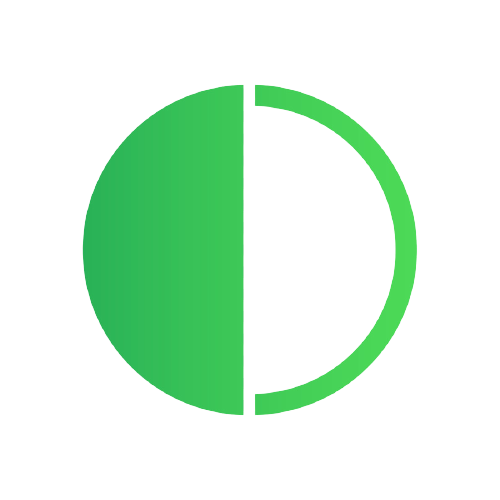

  

#  [projectname](https://linkProject)

  
    
  

- Change some repo and username in  code from shields and badges

 
- Understand what the project is about 

 - how to build/test/consume the project

## Changelog

The changelog process for this project is described [here](CHANGELOG.md).

## Documentation
The [ project ] documentations is hosted at [ project ](https://blockchain.lunes.io/telescope/)

## Contributing

` project ` is still under development. Contributions are always welcome! Please follow the [Developers Guide](CONTRIBUTING.md) if you want to help.

Thanks to the following people who have contributed to this project:

(github links)

* [@olivmath](https://github.com/olivmath)
* [@xonfps](https://github.com/xonfps)
* [@nunesinc](https://github.com/nunesinc)
* [@joelEsteves](https://github.com/joelesteves)
## Credits

- Made with [Docusaurus](https://docusaurus.io/)

## License
[ Project name ] is licensed under [Apache License v2.0](LICENSE)

